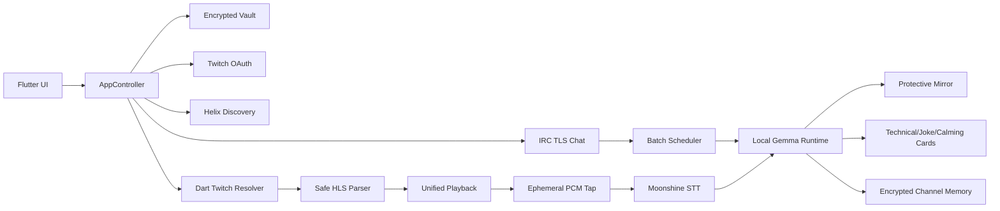

# Architecture

```mermaid
flowchart LR
  UI[Flutter UI] --> APP[AppController]
  APP --> VAULT[Encrypted Vault]
  APP --> AUTH[Twitch OAuth]
  APP --> HELIX[Helix Discovery]
  APP --> RESOLVER[Dart Twitch Resolver]
  RESOLVER --> HLS[Safe HLS Parser]
  HLS --> PLAYER[Unified Playback]
  APP --> IRC[IRC TLS Chat]
  IRC --> BATCH[Batch Scheduler]
  PLAYER --> PCM[Ephemeral PCM Tap]
  PCM --> STT[Moonshine STT]
  BATCH --> GEMMA[Local Gemma Runtime]
  STT --> GEMMA
  GEMMA --> SHIELD[Protective Mirror]
  GEMMA --> COMPANION[Technical/Joke/Calming Cards]
  GEMMA --> MEMORY[Encrypted Channel Memory]
```

The controller coordinates services but concrete network, media, storage, and inference code remains separated by directory and typed result boundaries.
